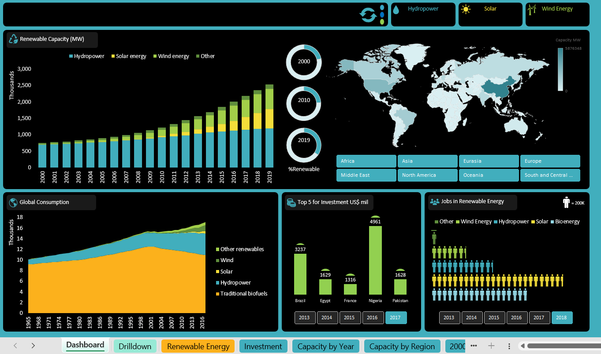

# Renewable Energy Analytics Dashboard (Excel + VBA)

## Overview
This project is an interactive Excel dashboard that analyzes renewable energy data across multiple dimensions including:

- Installed capacity
- Investments
- Energy consumption
- Jobs and employment

The dashboard provides a business intelligence style interface with filtering, drill-down navigation, and automated controls.

It demonstrates how Excel can be used as a lightweight analytics tool for reporting and decision-making.

---

## Features
- PivotTables and PivotCharts
- Slicers for interactive filtering
- Dashboard themes and formatting
- Hyperlink-based sheet navigation
- VBA macros for automation
- Clean, professional layout for stakeholders

---

## Tools & Skills Demonstrated
- Microsoft Excel (Advanced)
- Data cleaning and transformation
- PivotTables & PivotCharts
- Dashboard design
- KPI reporting
- VBA Macros
- Business Intelligence principles

---

## Dashboard Preview

---

## Use Case
This dashboard could be used by:
- Energy analysts
- Policy makers
- Sustainability teams
- Business stakeholders

to monitor renewable energy trends and support strategic planning.

